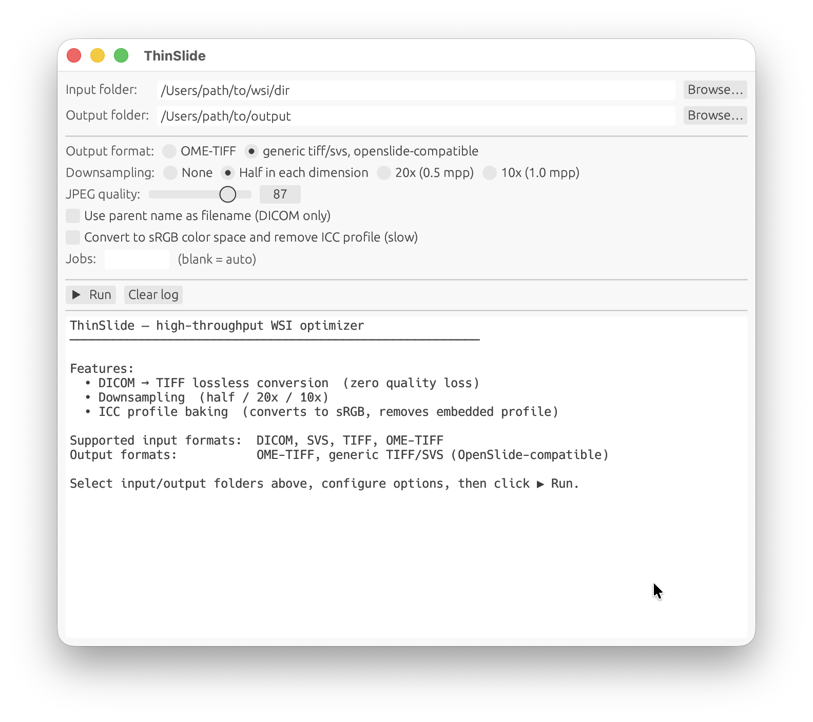

# ThinSlide

**Optimize whole-slide images** — for storage, portability, and interoperability.

- **Convert** — WSIs are fragmented. Consolidate them into clean TIFF/OME-TIFF. *(default)*
- **Downsample** — WSIs are heavy. Normalize 40x scans to 20x and cut storage by ~75%. `--20x`
- **Standardize** — Colors are not portable. Bake ICC profiles into the pixels. `--icc-bake`

## Formats

| Input | default | `--20x` | `--icc-bake` |
|---|:---:|:---:|:---:|
| **DICOM** | 🟢  | 🟡  | 🟡  |
| **VSI** (CellSens)¹ | 🟢  | 🟡  | 🟡  |
| **SVS / TIFF** | —² | 🟡  | 🟡  |

**🟢 repackaging** — compressed tiles are copied straight through, at near-copy speed. No image quality change.
**🟡 re-encoding** — only where the pixels actually change.

Output is OME-TIFF by default, or SVS-like BigTIFF with `--legacy`.

¹ Experimental reader. 16-bit fluorescence channels are skipped (8-bit brightfield only).
  `--mpp` is not supported for VSI yet.
² Already a single valid slide file — nothing to convert. Skipped unless combined with
  `--20x` or `--icc-bake`.

## Desktop app (no command line)

If you'd rather not use the terminal, **`thinslide-gui`** does the same thing in a window.

1. Download `thinslide-gui` for [macOS or Windows](../../releases/latest).
2. Open it, then choose a folder of slides and a destination folder.
3. Pick what you want, and click **Run**.

On macOS, also run `brew install libtiff little-cms2` once. No such step is needed on Windows.



## Command line

```sh
thinslide <input_dir> <output_dir> [options]
```

Input and output are directories — ThinSlide processes every slide it finds, mixed formats included.

```sh
# Convert a folder of DICOM slides into OME-TIFF (uses all CPUs)
thinslide /data/dicoms /data/output

# Same, but write SVS-like BigTIFF instead
thinslide /data/dicoms /data/output --legacy

# Normalize everything to 20x
thinslide /data/slides /data/output --20x

# Bake ICC profiles into pixels, output sRGB JPEG
thinslide /data/slides /data/output --icc-bake

# Both at once, in a single pass, tuning quality and threads
thinslide /data/slides /data/output --20x --icc-bake --quality 90 -j 4
```

> OME-TIFF inputs keep their original OME-XML metadata through downsampling.

### Installation

Prebuilt binaries are attached to every [release](https://github.com/uegamiw/thinslide/releases/latest).
Download the one for your platform, make it executable, and put it on your `PATH`:

| Platform | Asset | Includes GUI | Dependencies |
|----------|-------|:---:|---|
| Linux x86_64 | `thinslide-linux-x86_64-musl` | — | none (static musl) |
| macOS arm64 | `thinslide-macos-arm64` | ✓ | libtiff, Little CMS 2 |
| Windows x86_64 | `thinslide-windows-x86_64.exe` | ✓ | none (static) |

```sh
# Linux / macOS
curl -L -o thinslide https://github.com/uegamiw/thinslide/releases/latest/download/thinslide-linux-x86_64-musl
chmod +x thinslide
sudo mv thinslide /usr/local/bin/
```

On Windows, download `thinslide-windows-x86_64.exe` and add its folder to `PATH`.
On macOS, install the two dynamic libraries once with `brew install libtiff little-cms2`.

#### From crates.io or source

Requires a [Rust toolchain](https://rustup.rs) (edition 2024) and the **development**
headers for [libtiff](http://www.libtiff.org/) and [Little CMS 2](https://www.littlecms.com/):

```sh
brew install libtiff little-cms2          # macOS
sudo apt install libtiff-dev liblcms2-dev # Debian / Ubuntu
sudo dnf install libtiff-devel lcms2-devel # Fedora / RHEL

cargo install thinslide
```

## Advanced

**`--mpp <value>`** — downsample to an arbitrary resolution instead of normalizing to 20x.
Always resamples in full, so it is slower than `--20x`. Use `--filter` to pick the kernel.

```sh
thinslide /data/slides /data/output --mpp 0.5 --filter lanczos3
```

## Acknowledgments

ThinSlide's CellSens (.vsi) and MIRAX (.mrxs) readers were developed with reference to,
and in part ported from, the following open-source projects:

- [Bio-Formats](https://www.openmicroscopy.org/bio-formats/) (GPLv2) — CellSens VSI format parsing
- [OpenSlide](https://openslide.org/) (LGPL-2.1) — MIRAX format parsing

## License

Copyright (C) 2026 Wataru Uegami, MD, PhD

ThinSlide is licensed under the **GNU General Public License v2.0** — see [LICENSE](LICENSE).

## Disclaimer

ThinSlide is provided for **research use only**. It is not a medical device, has not been
cleared or approved by any regulatory authority, and is not intended for clinical diagnosis,
treatment, or any patient-care decision. The software is provided "as is", without warranty
of any kind, to the extent permitted by applicable law.