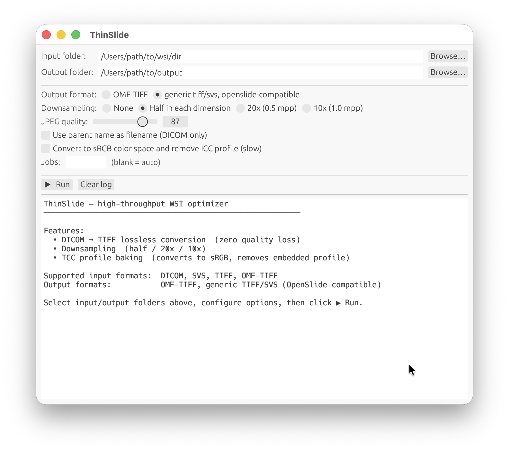

# ThinSlide

**Whole-slide image (WSI) optimization — toward sustainable digital pathology.**

- **Convert** — WSIs are fragmented. Consolidate them into clean TIFF/OME-TIFF.
- **Downsample** — WSIs are heavy. Normalize 40x scans to 20x and save storage by ~75%. `--scale 20x`
- **Standardize** — Colors are not portable. Bake ICC profiles into the pixels. `--icc-bake`

## Formats

| Input | default | `--scale 20x` | `--icc-bake` |
|---|:---:|:---:|:---:|
| **DICOM** | 🔵  | 🟢  | 🟢 |
| **SVS / TIFF** | —² | 🟢  | 🟢  |
| **VSI** (CellSens)¹ | 🔵  | 🟢  | 🟢  |

**🔵 repackaging** — compressed tiles are copied straight through, at near-copy speed. No image quality change.

**🟢 re-encoding** — only where the pixels actually change.

Output is OME-TIFF by default, or SVS-like BigTIFF with `--openslide` (matches the
source's original compression, and is readable by [OpenSlide](https://openslide.org/)).

¹ Experimental reader. 8-bit brightfield only.
  `--scale <number>` is not supported for VSI yet.
  
² Skipped unless combined with `--scale`, `--icc-bake` or `--roi`.

## Desktop app (no command)

If you'd rather not use the terminal, **`thinslide-gui`** does the same thing in a window.

1. Download `thinslide-macos-arm64.dmg` (macOS) or `thinslide-gui-windows-x86_64.exe` (Windows)
   from the [latest release](../../releases/latest).
2. On macOS, open the .dmg and drag **ThinSlide** into Applications. On Windows, just run the .exe.
3. Open it, then choose a folder of slides and a destination folder.
4. Pick what you want, and click **Run**.



> **macOS security warning?** Since ThinSlide isn't notarized by Apple, macOS may
> block it on first launch ("cannot be opened because the developer cannot be
> verified"). Go to **System Settings > Privacy & Security**, scroll down to the
> message about ThinSlide, and click **Open Anyway**. Confirm in the dialog that
> follows, then launch ThinSlide again.

## Command line

```sh
thinslide <input_dir> <output_dir> [options]
```

Input and output are directories — ThinSlide processes every slide it finds, mixed formats included.

```sh
# Convert a folder of DICOM slides into OME-TIFF (uses all CPUs)
thinslide /data/dicoms /data/output

# Same, but write SVS-like BigTIFF instead, OpenSlide-compatible
thinslide /data/dicoms /data/output --openslide

# Normalize everything to 20x
thinslide /data/slides /data/output --scale 20x

# Bake ICC profiles into pixels, output sRGB JPEG
thinslide /data/slides /data/output --icc-bake

# Both at once, in a single pass, tuning quality and threads
thinslide /data/slides /data/output --scale 20x --icc-bake --quality 90 -j 4
```

> OME-TIFF inputs keep their original OME-XML metadata through downsampling.

### Installation

Prebuilt binaries are attached to every [release](https://github.com/KimiaLabMayo/ThinSlide/releases/latest).
Download the one for your platform, make it executable, and put it on your `PATH`:

| Platform | Asset | Includes GUI | Dependencies |
|----------|-------|:---:|---|
| Linux x86_64 | `thinslide-linux-x86_64-musl` | — | none (static musl) |
| macOS arm64 | `thinslide-macos-arm64` | ✓ | none (static) |
| Windows x86_64 | `thinslide-windows-x86_64.exe` | ✓ | none (static) |

```sh
# Linux / macOS
curl -L -o thinslide https://github.com/KimiaLabMayo/ThinSlide/releases/latest/download/thinslide-linux-x86_64-musl
chmod +x thinslide
sudo mv thinslide /usr/local/bin/
```

On Windows, download `thinslide-windows-x86_64.exe` and add its folder to `PATH`.

#### From crates.io or source

Requires a [Rust toolchain](https://rustup.rs) (edition 2024) and the **development**
headers for [libtiff](http://www.libtiff.org/) and [Little CMS 2](https://www.littlecms.com/):

```sh
brew install libtiff little-cms2          # macOS
sudo apt install libtiff-dev liblcms2-dev # Debian / Ubuntu
sudo dnf install libtiff-devel lcms2-devel # Fedora / RHEL

cargo install thinslide
```

## Advanced

**`--scale <20x|half|quarter|number>`** — pick exactly one downsampling target:

- **`20x`** — auto-detect from source MPP and normalize to 20x scan magnification.
- **`half`** — halve both dimensions unconditionally, without reading source MPP.
  Useful when the source has no resolution metadata (so `20x` would have to skip it).
- **`quarter`** — quarter both dimensions unconditionally, without reading source MPP.
  Same idea as `half`, but a 1/4-scale level is usually already precomputed in the
  source pyramid (unlike 1/2), so this is typically faster.
- **`<number>`** — downsample to an arbitrary resolution (µm/px) instead of normalizing
  to 20x. Always resamples in full, so it is slower than `20x`/`half`/`quarter`.
  Use `--kernel` to pick the resampling kernel.

```sh
thinslide /data/slides /data/output --scale half
thinslide /data/slides /data/output --scale quarter
thinslide /data/slides /data/output --scale 0.5 --kernel lanczos3
```

**`--roi <file.geojson|DIR>`** — keep only the annotated regions (SVS / TIFF, DICOM and VSI input; not MRXS).
Annotations are [QuPath](https://qupath.github.io/) GeoJSON in level-0 pixel coordinates
(`FeatureCollection`, an array of features, a single feature, or a bare geometry;
`Polygon` and `MultiPolygon` are used, holes included).

- Processing stays tile-based: every tile an annotation passes through is kept, and every
  tile completely outside is filled with white.
- The output is cropped to the bounding box of the kept tiles (aligned to the tile grid),
  so a small region gives a small image.
- Tiles outside the annotations are never read, so conversion is faster and the
  output smaller.
- Full-resolution tiles go through the normal pipeline: copied straight through where possible
  (no quality change), re-encoded only where `--scale` or `--icc-bake` changes the pixels.
  The lower pyramid levels are rebuilt from them at 1/4 steps.
- Without `--scale`, the slide is cropped at full resolution.
- **`<file.geojson>`** — applies when the input holds a single slide (a slide file, or a
  folder with one DICOM series or one VSI).
- **`<DIR>`** — each slide is matched to `<DIR>/<name>.geojson`. Slides without a match are
  converted in full. The name is the file name without its extension for SVS / TIFF / VSI
  (e.g. `CMU-1.svs` → `CMU-1.geojson`), and the parent folder name for DICOM
  (e.g. `JP2K-33003-1/DCM_0.dcm` → `JP2K-33003-1.geojson`).
- JPEG 2000 tiles copied straight through are kept in `.ome.tiff`; with `--openslide` they are
  written as `.svs`, since OpenSlide reads JPEG 2000 only from SVS.
- **`--roi-id <ID[,ID...]>`** — use only the features whose top-level `"id"` matches one of
  the comma-separated IDs (e.g. `section-0` in a multi-section `sections.geojson`).
  Multiple IDs are cropped together into one output. A slide whose GeoJSON lacks any listed
  ID fails. Bare geometries (no feature) are ignored.

```sh
thinslide /data/CMU-1.svs /data/output --roi /data/CMU-1.geojson
thinslide /data/slides /data/output --roi /data/annotations --scale 20x
thinslide /data/CMU-3.svs /data/output --roi /data/sections.geojson --roi-id section-0 --scale half
```

## PHI handling

- **All output formats** — DICOM tags that identify a patient (patient name, ID, birth date,
  accession number, SeriesInstanceUID, etc.) are never copied into the output file's metadata.
  Only non-identifying technical parameters are retained: image dimensions, tile size,
  magnification (MPP), and compression. OME-TIFF additionally embeds the source `Manufacturer`
  in its OME-XML.
- **DICOM input — output filename** — by default the output filename is derived from the
  source SeriesInstanceUID (not from the in-file metadata above). Use `--use-parent-name` to
  name the output after the input folder instead if the UID should not appear in the filename.
- **TIFF / OME-TIFF output** — the label and thumbnail images are dropped from the output.
- **SVS output (`--openslide`)** — the label and thumbnail images are carried over from the
  source DICOM as-is; DICOM PHI tags are still not carried over.
- In all cases, any personal information that is visibly embedded in the tissue region itself
  (as image content, not metadata) is not removed.

## Acknowledgments

ThinSlide's CellSens (.vsi) and MIRAX (.mrxs) readers were developed with reference to,
and in part ported from, the following open-source projects:

- [Bio-Formats](https://www.openmicroscopy.org/bio-formats/) (GPLv2) — CellSens VSI format parsing
- [OpenSlide](https://openslide.org/) (LGPL-2.1) — MIRAX format parsing

## License

Copyright (C) 2026 Wataru Uegami, MD, PhD

ThinSlide is licensed under the GNU General Public License v2.0 or later (GPL-2.0-or-later).


## Disclaimer

ThinSlide is provided for **research use only**. It is not a medical device, has not been
cleared or approved by any regulatory authority, and is not intended for clinical diagnosis,
treatment, or any patient-care decision. The software is provided "as is", without warranty
of any kind, to the extent permitted by applicable law.
